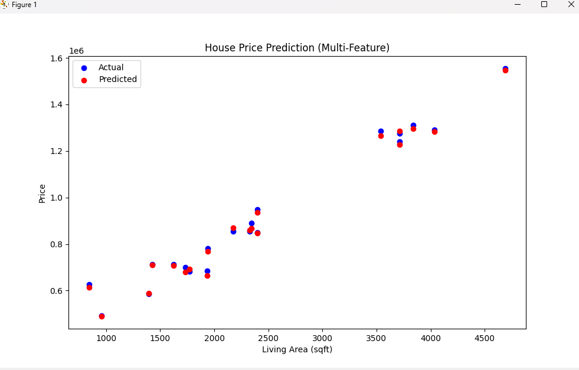

# 🏡 House Price Prediction Web App

This is a Streamlit-powered machine learning web app that predicts house prices based on features like:

- Living Area (sqft)
- Bedrooms
- Bathrooms
- Condition
- Grade
- Waterfront View

Built using **Python, Scikit-Learn, Pandas, and Streamlit**.

## 📊 How It Works

1. The model is trained using Linear Regression
2. All inputs are scaled using StandardScaler
3. User inputs are processed in real-time
4. Predictions are generated instantly with `house_price_model.pkl`

## 🚀 Try the App (Live)
🔗 [Your Streamlit URL goes here]

## 🧠 Tech Stack
- Python 3
- Pandas, NumPy
- Scikit-Learn
- Streamlit
- Matplotlib, Seaborn
- Joblib

## 🖼️ Preview

## 📁 Project Structure
